# Technical Architecture Guide
## Blockchain-Assisted MRV for Machine Learning Workloads

> **Complete technical documentation explaining how each component works and interacts**

---

## Table of Contents

1. [System Overview](#system-overview)
2. [Core Components](#core-components)
3. [Data Flow](#data-flow)
4. [Smart Contract Architecture](#smart-contract-architecture)
5. [Python Wrapper Deep Dive](#python-wrapper-deep-dive)
6. [Blockchain Integration](#blockchain-integration)
7. [Verification Mechanism](#verification-mechanism)
8. [Dashboard & UI](#dashboard--ui)
9. [Security Model](#security-model)
10. [Example Walkthrough](#example-walkthrough)

---

## System Overview

### What is MRV?

**MRV** stands for **Measurement-Reporting-Verification**, a framework used in environmental accounting to ensure transparency and trust in sustainability claims.

### The Problem

Machine learning training consumes significant energy, but current emission reporting suffers from:
- ❌ **Self-reported data** - no independent verification
- ❌ **Mutable local files** - data can be altered after creation
- ❌ **No audit trail** - impossible to prove data integrity over time

### The Solution

This project combines:
1. **CodeCarbon** - automated emission tracking during ML training
2. **Standardized MRV JSON** - consistent reporting format
3. **Cryptographic hashing (SHA-256)** - data fingerprinting
4. **Blockchain anchoring** - immutable proof of existence

```
ML Training → Emission Tracking → MRV JSON → Hash → Blockchain
                                      ↓
                                 Local Storage
                                      ↓
                            Anyone Can Verify ✓
```

---

## Core Components

The system consists of 5 major components:

### 1. Python Wrapper (`mrv_wrapper/`)
**Purpose**: Track emissions and generate MRV records during ML training

**Files**:
- [tracker.py](file:///c:/GreenComputing/mrv_wrapper/tracker.py) - Main `MRVTracker` class (context manager)
- [blockchain.py](file:///c:/GreenComputing/mrv_wrapper/blockchain.py) - Web3 integration for hash anchoring
- [storage.py](file:///c:/GreenComputing/mrv_wrapper/storage.py) - File persistence and ID generation
- [utils.py](file:///c:/GreenComputing/mrv_wrapper/utils.py) - Hardware detection, hashing, validation

### 2. Smart Contract (`contracts/`)
**Purpose**: Store immutable hash proofs on blockchain

**File**: [MRVRegistry.sol](file:///c:/GreenComputing/contracts/MRVRegistry.sol)
- Solidity contract (version 0.8.20)
- Maps MRV IDs to hash records
- Prevents overwrites (immutability guarantee)

### 3. Dashboard (`dashboard/`)
**Purpose**: Web-based verification interface

**Files**:
- `index.html` - User interface
- `app.js` - Verification logic (Web3.js integration)
- `config.js` - Contract ABI and configuration
- `styles.css` - Styling

### 4. Examples (`examples/`)
**Purpose**: Usage demonstrations

**Files**:
- `simple_example.py` - Basic usage demo
- `train_resnet.py` - Real ML training example
- `verify_mrv.py` - Command-line verification tool

### 5. Infrastructure
**Purpose**: Development and deployment tools

**Files**:
- [hardhat.config.js](file:///c:/GreenComputing/hardhat.config.js) - Blockchain development environment
- [scripts/deploy.js](file:///c:/GreenComputing/scripts/deploy.js) - Contract deployment script
- [setup.py](file:///c:/GreenComputing/setup.py) - Python package configuration

---

## Data Flow

### Phase 1: Training & Tracking


**What happens:**
1. Researcher wraps training code with `MRVTracker` context manager
2. CodeCarbon starts monitoring energy consumption (CPU, GPU, RAM)
3. Hardware information collected via `psutil` and `GPUtil`
4. Training executes normally
5. On completion, MRV JSON is generated with all metadata

### Phase 2: Hash & Anchor


**What happens:**
1. JSON is serialized deterministically (sorted keys)
2. SHA-256 hash computed: `sha256(JSON) → hash`
3. JSON saved to `mrv_data/MRV-{uuid}.json`
4. If blockchain enabled:
   - Convert hash to `bytes32` format
   - Build Ethereum transaction calling `registerMRV(mrvId, hashBytes)`
   - Sign with private key
   - Submit to blockchain
   - Wait for confirmation

### Phase 3: Verification


**What happens:**
1. User provides MRV ID and JSON file
2. Local hash computed from JSON
3. Blockchain queried for stored hash via `getMRVHash(mrvId)`
4. Comparison:
   - **Match** → Data integrity verified ✅
   - **Mismatch** → File tampered ❌
   - **Not found** → Never registered ⚠️

---

## Smart Contract Architecture

### Contract: MRVRegistry.sol

**Technology**: Solidity 0.8.20, Ethereum-compatible chains

#### Data Structure

```solidity
struct MRVRecord {
    bytes32 hash;        // SHA-256 hash of MRV JSON
    uint256 timestamp;   // Block timestamp (Unix time)
    address submitter;   // Ethereum address of submitter
    bool exists;         // Existence flag
}

mapping(string => MRVRecord) private mrvRecords;
```

#### Key Functions

**1. registerMRV(string mrvId, bytes32 hash)**
- **Purpose**: Store MRV hash on blockchain
- **Access**: Public (anyone can register)
- **Validation**:
  - MRV ID must be unique (no overwrites)
  - Hash must not be zero
- **Effects**:
  - Creates immutable record
  - Emits `MRVRegistered` event
  - Records `block.timestamp` and `msg.sender`

**2. getMRVHash(string mrvId)**
- **Purpose**: Retrieve stored hash
- **Returns**: `(hash, timestamp, submitter)`
- **Effects**: Emits `MRVQueried` event for analytics

**3. isMRVRegistered(string mrvId)**
- **Purpose**: Check if MRV ID exists
- **Returns**: `bool`
- **Gas**: Read-only (no gas cost when called externally)

**4. verifyMRVHash(string mrvId, bytes32 expectedHash)**
- **Purpose**: One-step verification
- **Returns**: `true` if hash matches, `false` otherwise

#### Security Features

✅ **Immutability**: Once registered, records cannot be modified  
✅ **Transparency**: All registrations emit events (public audit trail)  
✅ **Permissionless**: Anyone can register and verify  
✅ **Gas-efficient**: View functions don't consume gas externally

---

## Python Wrapper Deep Dive

### Component 1: MRVTracker (tracker.py)

**Primary Class**: Context manager for wrapping ML training code

#### Initialization

```python
MRVTracker(
    experiment_name: str,           # Required: experiment identifier
    model_name: str = "Unknown",    # Model architecture
    dataset_name: str = "Unknown",  # Dataset name
    epochs: int = None,             # Training epochs
    batch_size: int = None,         # Batch size
    framework: str = None,          # PyTorch, TensorFlow, etc.
    storage_dir: str = "mrv_data",  # Output directory
    registry_url: str = None,       # Optional remote registry
    blockchain_enabled: bool = True, # Enable blockchain anchoring
    auto_anchor: bool = True        # Auto-anchor on completion
)
```

#### Internal Flow

```python
# 1. __enter__() - Start tracking
def __enter__(self):
    self.start_time = time.time()
    self.emissions_tracker = EmissionsTracker()
    self.emissions_tracker.start()
    print("🌱 Starting MRV tracking...")
    return self

# 2. User's training code executes here

# 3. __exit__() - Stop and generate MRV
def __exit__(self, exc_type, exc_val, exc_tb):
    self.stop()
```

#### stop() Method - The Heart of MRV Generation

```python
def stop(self):
    # 1. Stop CodeCarbon
    emissions_data = self.emissions_tracker.stop()
    
    # 2. Calculate duration
    duration = time.time() - self.start_time
    
    # 3. Collect hardware info
    hardware = get_hardware_info()  # Calls psutil, GPUtil
    
    # 4. Build MRV JSON
    mrv_data = {
        "schema_version": "0.1",
        "mrv_id": storage.generate_mrv_id(),  # MRV-{uuid}
        "experiment": {...},
        "training": {...},
        "hardware": hardware,
        "energy_emissions": {
            "measurement_tool": "CodeCarbon",
            "energy_kwh": emissions_data.energy_consumed,
            "co2_kg": emissions_data.emissions,
            "duration_seconds": duration
        },
        "timestamps": {
            "start_time": self.start_time_iso,
            "end_time": get_current_timestamp()
        }
    }
    
    # 5. Compute hash
    self.mrv_hash = compute_hash(mrv_data)
    
    # 6. Save locally
    self.mrv_id = storage.save_mrv(mrv_data)
    
    # 7. Anchor on blockchain
    if self.blockchain_enabled and self.auto_anchor:
        self.tx_hash = blockchain.anchor_hash(self.mrv_id, self.mrv_hash)
```

### Component 2: BlockchainConnector (blockchain.py)

**Technology**: Web3.py library for Ethereum interaction

#### Connection Setup

```python
# Initialize Web3
self.w3 = Web3(Web3.HTTPProvider(rpc_url))

# Load contract
self.contract = self.w3.eth.contract(
    address=Web3.to_checksum_address(contract_address),
    abi=contract_abi  # Hardcoded minimal ABI
)

# Load account for signing
self.account = self.w3.eth.account.from_key(private_key)
```

#### Hash Anchoring Process

```python
def anchor_hash(self, mrv_id: str, hash_value: str) -> Optional[str]:
    # 1. Convert hex hash to bytes32
    hash_bytes = bytes.fromhex(hash_value)
    
    # 2. Get transaction nonce
    nonce = self.w3.eth.get_transaction_count(self.account.address)
    
    # 3. Build transaction
    transaction = self.contract.functions.registerMRV(
        mrv_id, hash_bytes
    ).build_transaction({
        'from': self.account.address,
        'nonce': nonce,
        'gas': 200000,
        'gasPrice': self.w3.eth.gas_price
    })
    
    # 4. Sign transaction
    signed_txn = self.w3.eth.account.sign_transaction(
        transaction, private_key=self.private_key
    )
    
    # 5. Send transaction
    tx_hash = self.w3.eth.send_raw_transaction(signed_txn.raw_transaction)
    
    # 6. Wait for confirmation
    receipt = self.w3.eth.wait_for_transaction_receipt(tx_hash)
    
    return tx_hash.hex() if receipt['status'] == 1 else None
```

### Component 3: Storage (storage.py)

**Responsibilities**: File I/O, MRV ID generation

#### MRV ID Format

```python
def generate_mrv_id(self) -> str:
    return f"MRV-{uuid.uuid4()}"
```

Example: `MRV-fc25ba52-f439-4834-be2b-2dbae1e03437`

#### File Storage

```python
def save_mrv(self, mrv_data: Dict[str, Any], mrv_id: str) -> str:
    filepath = self.storage_dir / f"{mrv_id}.json"
    
    # Deterministic serialization
    with open(filepath, 'w', encoding='utf-8') as f:
        json.dump(mrv_data, f, indent=2, sort_keys=True)
    
    return mrv_id
```

**Why `sort_keys=True`?**  
Ensures consistent hash computation regardless of Python dict ordering.

### Component 4: Utils (utils.py)

**Key Functions**:

**1. compute_hash(data: Dict) → str**
```python
def compute_hash(data: Dict[str, Any]) -> str:
    # Deterministic JSON serialization
    json_str = json.dumps(data, sort_keys=True, separators=(',', ':'))
    # SHA-256 hash
    return hashlib.sha256(json_str.encode('utf-8')).hexdigest()
```

**2. get_hardware_info() → Dict**
```python
def get_hardware_info() -> Dict[str, Any]:
    return {
        "cpu_type": platform.processor(),
        "cpu_cores": psutil.cpu_count(logical=False),
        "gpu_type": gpu.name if GPUtil available else "None",
        "num_gpus": len(GPUtil.getGPUs()),
        "ram_gb": round(psutil.virtual_memory().total / (1024**3)),
    }
```

**3. validate_mrv_json(data: Dict) → bool**
- Checks required fields exist
- Ensures schema compliance

---

## Blockchain Integration

### Network Configuration

**Supported Networks**:
- **Localhost** (Hardhat): `http://127.0.0.1:8545`
- **Sepolia Testnet**: via Infura/Alchemy
- **Ethereum Mainnet**: production deployment
- **Polygon, Arbitrum, etc.**: any EVM-compatible chain

### Environment Variables (.env)

```bash
# Blockchain RPC endpoint
BLOCKCHAIN_RPC_URL=http://127.0.0.1:8545

# Deployed contract address
CONTRACT_ADDRESS=0x5FbDB2315678afecb367f032d93F642f64180aa3

# Private key for signing transactions
PRIVATE_KEY=0xac0974bec39a17e36ba4a6b4d238ff944bacb478cbed5efcae784d7bf4f2ff80

# Network identifier
NETWORK=localhost
```

> [!CAUTION]
> **Never commit real private keys to Git!** Use test keys for localhost only.

### Transaction Flow

```
Python → Web3.py → HTTP RPC → Blockchain Node → Smart Contract
  ↓
Sign with Private Key
  ↓
Submit Transaction
  ↓
Wait for Block Confirmation (15s on mainnet, instant on localhost)
  ↓
Return Transaction Hash
```

### Gas Costs (Approximate)

- **registerMRV**: ~100,000 gas (~$3-5 on Ethereum mainnet)
- **getMRVHash**: 0 gas (read-only when called externally)
- **verifyMRVHash**: 0 gas (read-only)

**Cost Optimization**: Use Layer 2 (Polygon, Arbitrum) for <$0.01 per registration

---

## Verification Mechanism

### Three Verification Methods

#### 1. Command-Line (verify_mrv.py)

```bash
python examples/verify_mrv.py <MRV_ID> <JSON_FILE>
```

**Process**:
1. Load JSON from file
2. Compute local hash
3. Connect to blockchain
4. Call `getMRVHash(mrvId)`
5. Compare hashes
6. Display result: ✅ VALID / ❌ TAMPERED / ⚠️ NOT FOUND

#### 2. Web Dashboard

**Technologies**: HTML + JavaScript + Web3.js

**User Flow**:
1. Open `dashboard/index.html`
2. Connect to Metamask (or manual RPC)
3. Upload MRV JSON file
4. Enter MRV ID
5. Click "Verify Integrity"
6. See visual status indicator

#### 3. Programmatic (Python)

```python
from mrv_wrapper import MRVTracker

tracker = MRVTracker(...)
tracker.stop()

# Verify
is_valid = tracker.verify_on_blockchain()
```

### Verification Security Properties

✅ **Cryptographic Proof**: SHA-256 collision resistance  
✅ **Immutable Record**: Blockchain prevents tampering  
✅ **Timestamped**: Know exact registration time  
✅ **Transparent**: Anyone can verify with MRV ID + JSON

---

## Dashboard & UI

### Architecture

```
index.html (UI Structure)
    ↓
app.js (Verification Logic)
    ↓
config.js (Contract ABI + Address)
    ↓
Web3.js (Blockchain Communication)
    ↓
MRVRegistry Contract
```

### Key Features

1. **Blockchain Connection**
   - Auto-detect Metamask
   - Manual RPC URL input
   - Connection status indicator

2. **File Upload**
   - Drag-and-drop support
   - JSON validation
   - Hash computation in browser

3. **Verification Display**
   - ✅ **VALID** - Green, checkmark icon
   - ❌ **TAMPERED** - Red, X icon
   - ⚠️ **NOT FOUND** - Orange, warning icon

4. **Data Explorer**
   - View MRV JSON in formatted display
   - Show timestamp, submitter, hash

---

## Security Model

### Threat Model

**What We Protect Against**:
✅ Post-facto data modification  
✅ False emission claims  
✅ Unauditable records

**What We Don't Protect Against**:
❌ Malicious emission tracking (garbage in, garbage out)  
❌ Private key theft (blockchain security assumption)

### Trust Assumptions

1. **CodeCarbon**: Accurately measures energy consumption
2. **Blockchain Network**: Byzantine fault-tolerant consensus
3. **User**: Protects private key
4. **Smart Contract**: No bugs (audited code recommended)

### Privacy Considerations

**What's Public**:
- MRV ID
- SHA-256 hash
- Registration timestamp
- Submitter address

**What's Private**:
- Full MRV JSON (stored locally)
- Hardware details (optional sharing)
- Researcher identity (pseudonymous via address)

**Recommendation**: Use burner addresses for privacy, publish MRV JSON voluntarily for transparency

---

## Example Walkthrough

### Real-World Usage: ResNet18 on CIFAR-10

**File**: [train_resnet.py](file:///c:/GreenComputing/examples/train_resnet.py)

#### Step 1: Wrap Training Code

```python
from mrv_wrapper import MRVTracker

with MRVTracker(
    experiment_name="resnet18_cifar10_baseline",
    model_name="ResNet18",
    dataset_name="CIFAR-10",
    epochs=90,
    batch_size=128,
    framework="PyTorch"
) as tracker:
    # Your normal training code
    model = create_resnet18()
    train(model, epochs=90, batch_size=128)
```

#### Step 2: Training Executes

- CodeCarbon monitors CPU/GPU usage
- Energy consumption tracked every second
- Researcher sees normal training logs

#### Step 3: Automatic MRV Generation

On context exit:
```python
# MRV JSON created
{
  "mrv_id": "MRV-abc123...",
  "energy_emissions": {
    "energy_kwh": 0.87,
    "co2_kg": 0.42,
    "duration_seconds": 5400  # 90 minutes
  },
  ...
}

# Hash computed: sha256(JSON) = "3f2a9b..."

# Saved to: mrv_data/MRV-abc123.json

# Blockchain anchored: TX 0x4d8e1f...
```

#### Step 4: Include in Research Paper

```latex
We trained ResNet18 on CIFAR-10 for 90 epochs, consuming 
0.87 kWh and emitting 0.42 kg CO₂ (MRV ID: MRV-abc123). 
Verification: https://verify.mrv-ml.org/?id=MRV-abc123
```

#### Step 5: Peer Verification

Reviewer downloads `MRV-abc123.json`, runs:
```bash
python verify_mrv.py MRV-abc123 MRV-abc123.json
```

Output:
```
✅ VALID - Hashes match!
   CO2: 0.42 kg
   Energy: 0.87 kWh
   Timestamp: 2026-01-11T09:30:00Z
```

---

## Summary

### System Architecture in One Diagram

```mermaid
graph TB
    A[ML Training Code] --> B[MRVTracker<br/>Python Wrapper]
    B --> C[CodeCarbon<br/>Emission Tracking]
    B --> D[Hardware Detection<br/>psutil, GPUtil]
    C --> E[Generate MRV JSON]
    D --> E
    E --> F[Compute SHA-256 Hash]
    F --> G[Save Locally<br/>mrv_data/*.json]
    F --> H[BlockchainConnector<br/>Web3.py]
    H --> I[Sign Transaction]
    I --> J[MRVRegistry.sol<br/>Smart Contract]
    J --> K[Immutable Storage<br/>Ethereum/Polygon/etc]
    
    L[Verification] --> M[Load JSON]
    M --> N[Compute Local Hash]
    N --> O[Query Blockchain]
    O --> J
    J --> P{Hash Match?}
    P -->|Yes| Q[✅ VALID]
    P -->|No| R[❌ TAMPERED]
    
    style B fill:#4CAF50
    style E fill:#2196F3
    style F fill:#FF9800
    style J fill:#9C27B0
    style Q fill:#4CAF50
    style R fill:#F44336
```



### Key Innovations

1. **Zero Trust, Verify Everything**: Blockchain provides trustless verification
2. **Developer-Friendly**: Simple Python context manager
3. **Standards-Based**: MRV JSON schema for interoperability
4. **Scalable**: Works from research laptops to datacenter clusters
5. **Open & Transparent**: Anyone can verify, no proprietary tools needed

---

## Next Steps

### For Developers
- Integrate `MRVTracker` into your ML training pipeline
- Deploy `MRVRegistry` to a testnet (Sepolia recommended)
- Customize MRV JSON schema for your domain

### For Researchers
- Include MRV IDs in papers for reproducibility
- Publish MRV JSONs alongside code/models
- Build on sustainability transparency

### For Infrastructure
- Deploy centralized registry (optional)
- Set up automated verification CI/CD
- Create public explorer UI

---

**Built with 💚 for sustainable AI**

> For questions or contributions, see the [main README](file:///c:/GreenComputing/README.md)
